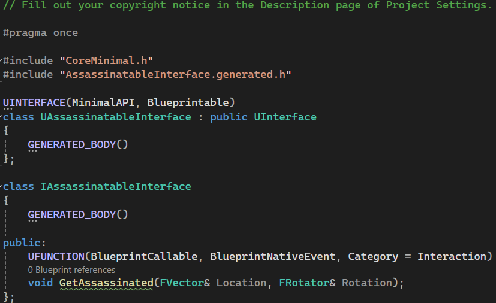

# Unreal Engine 5 RPG Example

## Description

This is used to demonstrate how to create an RPG game using Unreal Engine 5. This example requires the experimental Motion Warping extension.

## Topics
### Motion Warping

### State Machine

### HUD

### C++ UInterface

### Blend Space 1D

## Reference
https://www.youtube.com/watch?v=FNTyIWkv5k8&list=PLiSlOaRBfgkcPAhYpGps16PT_9f28amXi&index=2
